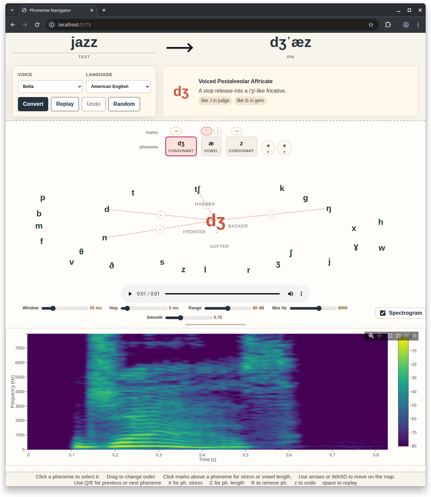

# Phoneme Navigator

A web UI for repairing Kokoro pronunciations by navigating local IPA alternatives instead of manually editing phoneme strings.

- Paste text.
- Phonemize with Kokoro-FastAPI.
- Click a phoneme token.
- Choose a nearby perceptual edit.
- Replay instantly.

<p align="center">
  
</p>

<details>
<summary><strong>Video Demo</strong></summary>

<video src="docs/demo_video_1.mp4" controls width="100%"></video>

If your Markdown viewer does not render embedded video, open [docs/demo_video_1.mp4](docs/demo_video_1.mp4).

</details>

## Demo

Phoneme Navigator turns Kokoro output into selectable tokens, then lets you move through "phoneme space" with labelled alternatives for vowels, consonants, stress, and local repairs.

Input text:

```text
Metals contract as they cool.
```

Kokoro default:

```text
[kˈɑntɹˌækt]
```

Edited:

```text
[kˌɑntɹˈækt]
```

In the app, the user adjusts stress and vowel quality through labelled candidate moves, then replays the edited phoneme string through Kokoro-FastAPI.

## Why This Exists

Users often know the direction of a pronunciation error better than the exact IPA symbol they want.

Phoneme Navigator is built around that idea. Instead of asking users to hand-edit raw IPA, it tokenises Kokoro phoneme strings into sensible editable units, lets the user select one token, and offers nearby perceptual moves such as "weaker", "more open", "rounder", or "backer". Candidate edits carry both an IPA replacement and a plain-language label, and the candidate graph is intentionally task-specific rather than a full IPA chart.

## Highlights

- Text-to-phoneme conversion through Kokoro-FastAPI.
- Token-level phoneme editing with IPA-aware grouping.
- Directional candidate moves for vowels, consonants, stress, and local repairs.
- One-click audio replay from the current edited phoneme string.
- React/Vite frontend, FastAPI backend, and Docker Compose setup with Kokoro included.

## Get Started

Start the full stack with Kokoro-FastAPI, the backend, and the frontend:

```bash
docker compose up --build
```

Then open the web app:

- Frontend: <http://localhost:8080>

<details>
<summary><strong>Details and GPU Usage</strong></summary>

Additional local endpoints:

- Backend health: <http://localhost:8000/healthz>
- Kokoro-FastAPI: <http://localhost:8880>

The default compose file uses the Kokoro CPU image:

```text
ghcr.io/remsky/kokoro-fastapi-cpu:latest
```

On a CUDA-capable host, use the GPU override:

```bash
docker compose -f docker-compose.yml -f docker-compose.gpu.yml up --build
```

You can override exposed ports with environment variables:

```bash
FRONTEND_PORT=8081 BACKEND_PORT=8001 KOKORO_PORT=8881 docker compose up --build
```

The backend image installs only the main Python dependency set. Notebook, plotting, testing, formatting, and other development dependencies remain in the `dev` extra and are not included in the runtime container.

</details>

## Basic Workflow

1. Enter a word or short phrase.
2. Press `Phonemize` or Enter.
3. The backend calls Kokoro-FastAPI `/dev/phonemize`.
4. The returned phoneme string is tokenised into editable units.
5. Select a token by mouse or keyboard.
6. Browse local candidate moves around that token.
7. Apply a move to update the phoneme string.
8. Replay the result through Kokoro-FastAPI `/dev/generate_from_phonemes`.

## Configuration

Phoneme Navigator expects a running Kokoro-FastAPI server. The web app does not currently include a mock mode.

| Component | Default |
|---|---|
| Frontend | `http://localhost:8080/` |
| Backend | `http://localhost:8000/` |
| Kokoro URL | `http://localhost:8880/` |
| Voice | `af_bella` |
| Language | `a` |

Relevant upstream Kokoro endpoints:

```text
POST /dev/phonemize
POST /dev/generate_from_phonemes
```

The backend default is configured in [src/phoneme_navigator/core/config.py](src/phoneme_navigator/core/config.py). You can override it with a local `.env` file:

```bash
PHONEME_NAV_KOKORO_BASE_URL=http://your-host:8880/
```

Check the backend:

```bash
curl http://localhost:8000/healthz
```

Phonemize text:

```bash
curl -X POST http://localhost:8000/api/phonemize \
  -H 'Content-Type: application/json' \
  -d '{"text":"Metals contract as they cool.","language":"a"}'
```

## Keyboard Shortcuts

The notebook prototype used a keyboard-first interaction model. The current web app already carries part of that over:

- `Left` and `Right` move between editable tokens.
- `Up` and `Down` apply matching vertical candidate moves when present.
- `Space` replays the current phoneme string.
- `z` undoes the last edit.

The notebook also defined additional directional shortcuts and edit commands, and those can be added as the lattice UI is ported over.

## Development

Install Python dependencies:

```bash
uv sync --extra dev
```

Install frontend dependencies:

```bash
npm --prefix frontend install
```

Start the backend:

```bash
./scripts/run_backend.sh
```

Start the frontend:

```bash
./scripts/run_frontend.sh
```

Check Kokoro reachability:

```bash
./scripts/check_kokoro.sh
```

The devcontainer forwards these ports:

- `5173` for the Vite frontend.
- `8000` for the FastAPI backend.
- `8880` for Kokoro-FastAPI.

Run tests with:

```bash
uv run pytest
```

Build the frontend with:

```bash
npm --prefix frontend run build
```

Backend logs are written to `./logs/backend.log` with rotating file handling and structured `extra` payloads.

Useful scripts:

- [scripts/run_backend.sh](scripts/run_backend.sh)
- [scripts/run_frontend.sh](scripts/run_frontend.sh)
- [scripts/check_kokoro.sh](scripts/check_kokoro.sh)
- [scripts/tail_logs.sh](scripts/tail_logs.sh)

## Architecture

This repository contains three related surfaces:

- A Python backend under [src/phoneme_navigator](src/phoneme_navigator)
- A React/Vite frontend under [frontend](frontend)

The browser talks to the Python backend, and the backend talks to Kokoro. This keeps Kokoro-specific request shapes, error handling, and future phonological logic out of the browser.

- `frontend/`
  React UI for text entry, token selection, candidate application, undo, and audio replay.
- `src/phoneme_navigator/api/`
  FastAPI routes for health, phonemization, navigation rebuild, and speech synthesis.
- `src/phoneme_navigator/domain/`
  Pure tokenization and candidate-move logic translated from the notebook.
- `src/phoneme_navigator/clients/`
  Kokoro-FastAPI HTTP client.
- `src/phoneme_navigator/services/`
  Orchestration that converts Kokoro responses into frontend navigation state.


## API Surface

Current backend routes:

- `GET /healthz`
- `POST /api/phonemize`
- `POST /api/navigation`
- `POST /api/speak`
- `GET /api/voices`
- `POST /api/spectrogram`

The two routes that define the main editing loop are:

- `/api/phonemize`
  Text to phoneme string plus token navigation state.
- `/api/navigation`
  Phoneme string to refreshed token navigation state after an edit.


# TODO
- licence
- test running with docker compose
- check github pytest is working
- add link to github repo at the top of the web ui
- details of options in the web ui